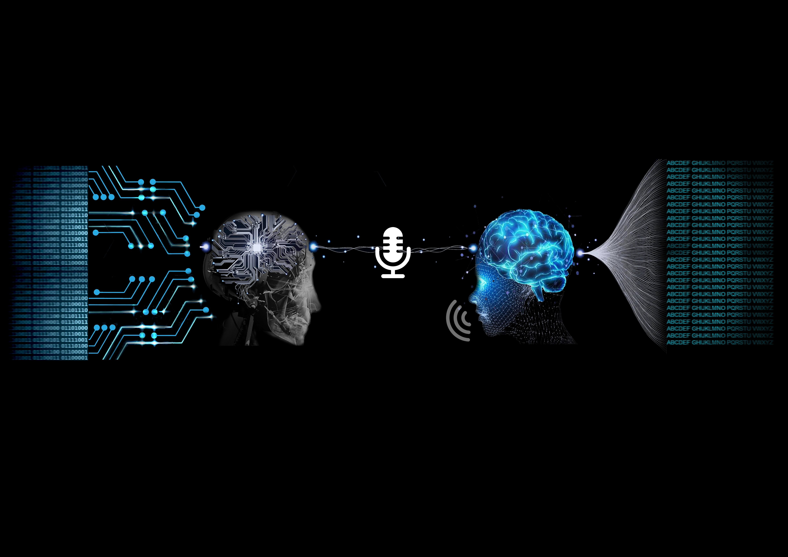
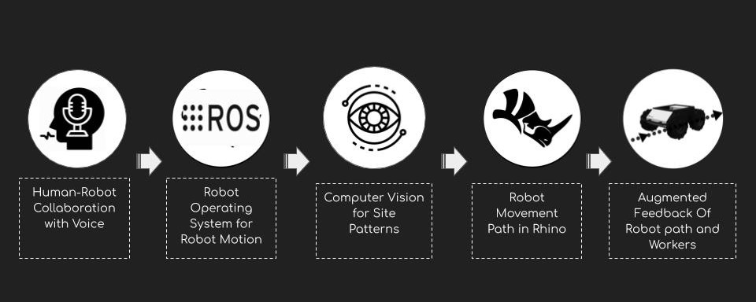
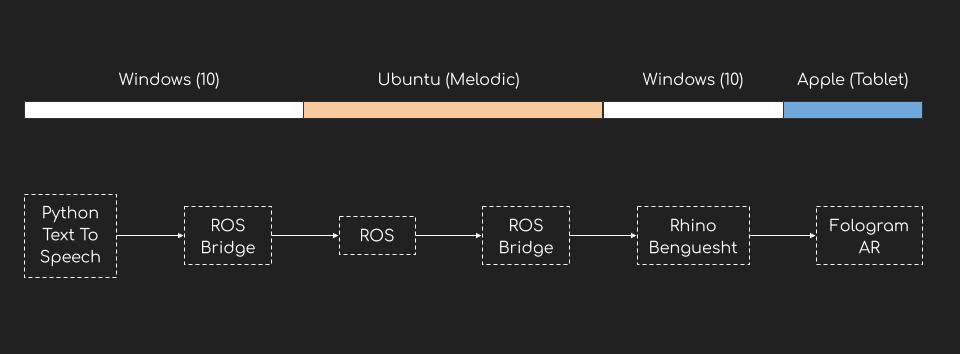

# Human-Machine-Interaction
Proposal for communicating with robots from voice commands in real time and getting augmented feedback of robotic paths on construction site

## Background
Construction site is very dynamic and due to the development in robotics for construction (example boston dynamics) there seems to be huge gap of knowledge for workers to understand these technologies. To make it more human friendly connection there is a need for a human-machine interctive tools.Proposal is to allow workers to communicate with robots on construction site with simple language commands and also will be able to see the feedback of robots on construction site in form of robotic paths with augmented reality.

## Hardware Requirement
* **Mixed Reality Supported Mobile Phone:** Combination of sensors (such RGB and depth camera frames, accelerometer and gyroscope data) required in the process of pose estimation and rendering of model
* **Kobuki Robot:**  Kobuki is a low-cost mobile research base designed for education and research on state of art robotics
* **Arduino Robot:**  Battery 9V, Arduino Uno, Motor Driver L293D, Bluetooth WirelessHC-05 UART, Kraft Board, DC Motor3-6V, Rubber Wheels, Jumping Wires

## Software Requirement
* **Robot Oporating System (Ros):** For intializing nodes and doing simulation
* **Python IDE:** For tracking with Open CV
* **Pocketsphinx:** For traslating the speech to text offline
* **ROS Bridge:** For websocket communication
* **Benguesht:** For Connection of ROS and Gh
* **Fologram:** For showing the model and paths in real environment with AR

## Setup
* **ROS:** Setup the ROS environment for turtle robot and intialize the rosbridge 
* **Speech To Text:** Run the python script to translate from speech to text commands and then filter commands needed for controlling
the robot.
* **Live in Rhino Environment:** Setup the Benguesht by providing the topic to listen and ip configuration
* Run all in parallel

## Workflow

